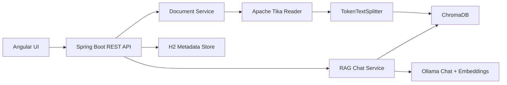

# document-rag-using-spring-ai-and-angular

Full-stack Retrieval-Augmented Generation (RAG) starter using Spring Boot, Spring AI, Ollama, ChromaDB, Apache Tika, and Angular. The backend ingests PDF/Word/text-style documents, chunks content with an open-source token-aware splitter, stores embeddings in ChromaDB, and exposes documented REST APIs. The frontend provides a chat-style UI for uploading files and querying the indexed knowledge base.

## What is included

- Spring Boot backend with layered structure: `controller`, `service`, `repository`, `entity`, `dto`, `exception`, `config`
- Spring AI RAG flow using `QuestionAnswerAdvisor`
- ChromaDB vector store integration
- Ollama chat + embedding model configuration for open-source local models
- Apache Tika-based document ingestion for `pdf`, `doc`, `docx`, `txt`, `md`, `html`, `ppt`, `pptx`
- Token-aware chunking with Spring AI `TokenTextSplitter`
- Swagger / OpenAPI UI
- Angular chat UI with upload panel, document catalog, citations, and conversation actions
- Architecture and low-level design documentation

## Architecture



More detail:

- High-level architecture: [docs/architecture.md](./docs/architecture.md)
- Low-level design: [docs/low-level-architecture.md](./docs/low-level-architecture.md)

## Backend stack

- Spring Boot `3.5.11`
- Spring AI BOM `1.1.4`
- Springdoc OpenAPI `3.0.3`
- ChromaDB as the vector database
- Ollama for local open-source chat and embedding models
- Apache Tika for document extraction
- H2 for metadata and conversation persistence

These versions were chosen from official Spring / Maven Central references current on April 22, 2026.

## Project layout

```text
.
├── backend
│   ├── src/main/java/com/aeon/documentrag/backend
│   └── src/main/resources/application.yml
├── frontend
│   └── src/app
├── docs
│   ├── architecture.md
│   └── low-level-architecture.md
└── infra
    └── docker-compose.yml
```

## Supported APIs

Swagger UI:

- [http://localhost:8080/swagger-ui.html](http://localhost:8080/swagger-ui.html)

Main endpoints:

- `POST /api/v1/documents/ingest` uploads and indexes files
- `GET /api/v1/documents` lists indexed documents
- `GET /api/v1/documents/{documentId}` fetches one document record
- `DELETE /api/v1/documents/{documentId}` removes file metadata and vector chunks
- `POST /api/v1/chat/messages` runs grounded chat over ChromaDB
- `GET /api/v1/chat/conversations/{conversationId}` reads saved conversation history
- `DELETE /api/v1/chat/conversations/{conversationId}` deletes a saved conversation

## How ingestion works

1. A file is uploaded through the REST API or Angular UI.
2. Spring stores the file locally.
3. Apache Tika extracts text from the source document.
4. Spring AI `TokenTextSplitter` breaks text into semantic-friendly chunks.
5. Each chunk is annotated with metadata such as `documentId`, filename, checksum, and chunk index.
6. Chunks are embedded through Ollama and stored in ChromaDB.
7. The chat endpoint retrieves similar chunks and sends them to the model through a RAG advisor.

## Prerequisites

- Java 21
- Node.js 22+
- Docker for ChromaDB
- Ollama installed locally or reachable remotely

Recommended Ollama models:

```bash
ollama pull llama3.2
ollama pull nomic-embed-text
```

## Run the project

### 1. Start ChromaDB

```bash
docker compose -f infra/docker-compose.yml up -d
```

### 2. Make sure Ollama is running

```bash
ollama serve
```

If Ollama is already installed as a background service, you can skip that command.

### 3. Start the backend

```bash
cd backend
./mvnw spring-boot:run
```

### 4. Start the frontend

```bash
cd frontend
npm install
npm start
```

Frontend URL:

- [http://localhost:4200](http://localhost:4200)

## Configuration notes

The main backend settings live in [backend/src/main/resources/application.yml](./backend/src/main/resources/application.yml).

Important values:

- `spring.ai.ollama.base-url`
- `spring.ai.ollama.chat.options.model`
- `spring.ai.ollama.embedding.options.model`
- `spring.ai.vectorstore.chroma.client.host`
- `spring.ai.vectorstore.chroma.client.port`
- `app.rag.chunk-size`
- `app.rag.similarity-threshold`
- `app.storage.upload-dir`

## Frontend features

- Multi-file upload
- Indexed document catalog
- Chat conversation panel
- Retrieved context citations shown with assistant answers
- Proxy configuration for local backend access during development

## Useful commands

Backend test:

```bash
cd backend
./mvnw test
```

Frontend build:

```bash
cd frontend
npm run build
```

## Notes

- ChromaDB and Ollama are external runtime dependencies and must be reachable for real RAG requests.
- The backend stores document metadata and chat history in local H2 files for easy local development.
- Uploaded files are stored on disk and ignored by git.
