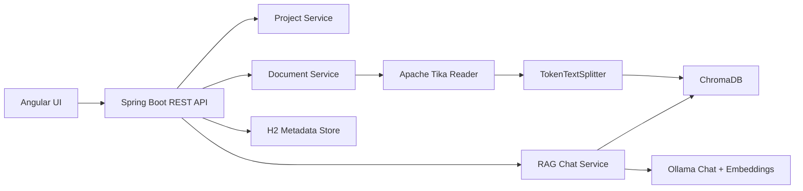
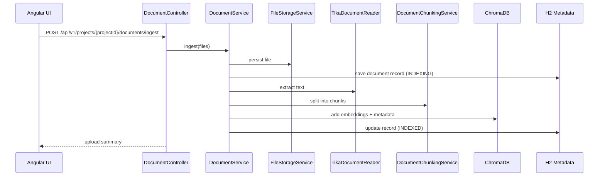
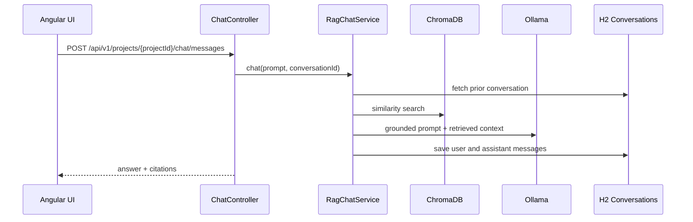

# document-rag-using-spring-ai-and-angular

Full-stack Retrieval-Augmented Generation (RAG) starter using Spring Boot, Spring AI, Ollama, ChromaDB, Apache Tika, and Angular. The backend lets users create projects, ingest PDF/Word/text-style documents into a chosen project, chunk and embed them into ChromaDB, and chat only against that project's knowledge base. The frontend provides a project-aware chat UI for project creation, upload, and scoped retrieval.

## What is included

- Spring Boot backend with layered structure: `controller`, `service`, `repository`, `entity`, `dto`, `exception`, `config`
- Lombok-powered constructor injection and reduced backend boilerplate
- Spring AI RAG flow using `QuestionAnswerAdvisor`
- ChromaDB vector store integration
- Project-scoped RAG so each project's documents, conversations, and retrieval stay isolated
- Ollama chat + embedding model configuration for open-source local models
- Apache Tika-based document ingestion for `pdf`, `doc`, `docx`, `txt`, `md`, `html`, `ppt`, `pptx`
- Token-aware chunking with Spring AI `TokenTextSplitter`
- Swagger / OpenAPI UI
- Angular chat UI with upload panel, document catalog, citations, and conversation actions
- Embedded architecture and low-level design documentation in this README

## Architecture



## Architecture Overview

### Goal

Provide a local-first, open-source-friendly RAG application where users can ingest business documents and interact with them through a conversational UI.

### System components

#### Frontend

- Angular standalone application
- Project creation and selection workflow
- Chat workspace for prompt entry and response rendering
- Upload flow for project-specific ingestion
- Document list for the selected project

#### Backend

- Spring Boot REST API
- Project management API
- Spring AI orchestration for retrieval + generation
- Apache Tika extraction pipeline
- H2 persistence for project, document, and conversation metadata

#### External runtime services

- Ollama for chat and embedding models
- ChromaDB for vector persistence and similarity search

### Request flows

#### Document ingestion flow



#### Chat flow



### Architectural choices

#### Layered backend

- `controller`: HTTP entry points
- `service`: orchestration and business logic
- `repository`: Spring Data JPA persistence access
- `entity`: H2 persistence models
- `dto`: API contracts
- `config`: infrastructure and external client configuration
- `exception`: cross-cutting error handling

#### Why Tika + TokenTextSplitter

- Tika supports a wide set of office and document file formats.
- Spring AI `TokenTextSplitter` gives token-aware chunking rather than naive fixed-character slicing.
- Chunk metadata is preserved for traceability and deletion.

#### Why H2 plus ChromaDB

- H2 stores operational metadata: upload status, filenames, checksums, and conversation history.
- H2 also stores project ownership so retrieval and chat stay project-specific.
- ChromaDB stores chunk embeddings and supports similarity search.
- Separating operational persistence from vector persistence keeps responsibilities clear.

#### Deployment shape

- Angular dev server on `4200`
- Spring Boot backend on `8080`
- ChromaDB on `8000`
- Ollama on `11434`

## Low-Level Architecture

### Backend package map

```text
com.aeon.documentrag.backend
├── config
├── controller
├── dto
├── entity
│   └── type
├── exception
├── mapper
├── repository
└── service
```

### Important classes

#### `DocumentController`

- Accepts multipart uploads into a selected project
- Lists document records for a selected project
- Deletes project-scoped document records and vector chunks

#### `ProjectController`

- Creates project workspaces
- Lists available projects
- Deletes a project with its knowledge base and conversation history

#### `ChatController`

- Accepts project-scoped chat prompts
- Returns generated answer plus citations
- Exposes project-scoped conversation read/delete endpoints

#### `DocumentService`

- Validates file types
- Resolves project ownership
- Stores uploaded files
- Runs Tika extraction
- Calls chunking service
- Writes chunk documents to ChromaDB
- Keeps H2 metadata synchronized

#### `DocumentChunkingService`

- Builds Spring AI `TokenTextSplitter` from config
- Applies metadata enrichment
- Generates deterministic chunk IDs per document

#### `RagChatService`

- Builds a `SearchRequest`
- Retrieves similar chunks from ChromaDB with a `projectId` filter
- Calls Spring AI `QuestionAnswerAdvisor`
- Persists user and assistant messages
- Returns citations for transparency

#### `ConversationService`

- Creates or validates project-owned conversation IDs
- Persists messages
- Renders bounded conversation history for prompting

#### `ProjectService`

- Creates and loads project metadata
- Computes per-project document and conversation counts
- Deletes project resources, stored files, and vector chunks

### Persistence model

#### `ProjectEntity`

Tracks:

- project identity
- project name and description
- creation/update timestamps

#### `DocumentRecordEntity`

Tracks:

- owning project
- upload identity
- source filename
- local storage path
- checksum
- chunk count
- indexing status
- failure reason

#### `ConversationEntity`

Tracks:

- owning project
- conversation identity
- derived title
- creation/update timestamps

#### `ConversationMessageEntity`

Tracks:

- message role
- message body
- creation timestamp
- conversation ownership

### Library detail

#### Spring Boot

- REST layer, dependency injection, validation, JPA, actuator

#### Lombok

- `@RequiredArgsConstructor` for constructor injection in controllers and services
- `@Getter`, `@Setter`, and `@NoArgsConstructor` to keep JPA entities concise while preserving service-layer construction
- `@UtilityClass` for mapper helpers
- `@Slf4j` for lightweight backend diagnostics

#### Spring AI

- `ChatClient` for model interaction
- `QuestionAnswerAdvisor` for RAG context injection
- `TokenTextSplitter` for chunking
- Chroma vector store starter
- Ollama model starter

#### Apache Tika

- Text extraction for office and document formats without format-specific controller code

#### Springdoc OpenAPI

- Swagger UI and generated API schema

#### Angular

- Standalone component architecture
- `HttpClient` services for backend integration
- Signal-based local UI state

### Endpoint detail

#### `POST /api/v1/projects`

Request JSON:

```json
{
  "name": "Vendor Contracts",
  "description": "All supplier agreements and pricing attachments"
}
```

Response:

- created project metadata with document and conversation counts

#### `POST /api/v1/projects/{projectId}/documents/ingest`

Request:

- `multipart/form-data`
- field name: `files`

Response:

- upload count
- indexed document metadata list for the selected project

#### `GET /api/v1/projects/{projectId}/documents`

Response:

- all document metadata records for that project ordered by newest first

#### `DELETE /api/v1/projects/{projectId}/documents/{documentId}`

Behavior:

- deletes chunk IDs from ChromaDB
- deletes local stored file
- deletes H2 metadata record only for the selected project

#### `POST /api/v1/projects/{projectId}/chat/messages`

Request JSON:

```json
{
  "conversationId": "optional-existing-id",
  "prompt": "Summarize the uploaded policy",
  "topK": 5
}
```

Response JSON:

```json
{
  "conversationId": "uuid",
  "projectId": "project-1",
  "answer": "Grounded answer...",
  "citations": [
    {
      "chunkId": "doc-1-chunk-1",
      "projectId": "project-1",
      "documentId": "doc-1",
      "sourceFileName": "policy.pdf",
      "chunkIndex": 1,
      "excerpt": "Relevant text..."
    }
  ],
  "respondedAt": "2026-04-22T22:00:00Z"
}
```

### Chunking configuration

Defined in `application.yml`:

- `app.rag.chunk-size`
- `app.rag.min-chunk-size-chars`
- `app.rag.min-chunk-length-to-embed`
- `app.rag.max-num-chunks`
- `app.rag.keep-separator`

This keeps chunk sizing configurable without code changes.

### Runtime assumptions

- ChromaDB is reachable at `http://localhost:8000`
- Ollama is reachable at `http://localhost:11434`
- Default chat model: `llama3.2`
- Default embedding model: `nomic-embed-text`

## Backend stack

- Spring Boot `3.5.11`
- Spring AI BOM `1.1.4`
- Springdoc OpenAPI `3.0.3`
- Lombok for constructor injection, mapper utilities, logging, and JPA boilerplate reduction
- ChromaDB as the vector database
- Ollama for local open-source chat and embedding models
- Apache Tika for document extraction
- H2 for metadata and conversation persistence

These versions were chosen from official Spring / Maven Central references current on April 22, 2026.

## Project layout

```text
.
├── backend
│   ├── src/main/java/com/aeon/documentrag/backend
│   └── src/main/resources/application.yml
├── frontend
│   └── src/app
└── infra
    └── docker-compose.yml
```

## Supported APIs

Swagger UI:

- [http://localhost:8080/swagger-ui.html](http://localhost:8080/swagger-ui.html)

Main endpoints:

- `POST /api/v1/projects` creates a project
- `GET /api/v1/projects` lists projects
- `GET /api/v1/projects/{projectId}` fetches project details
- `DELETE /api/v1/projects/{projectId}` deletes a project with its indexed data
- `POST /api/v1/projects/{projectId}/documents/ingest` uploads and indexes files for one project
- `GET /api/v1/projects/{projectId}/documents` lists indexed documents for one project
- `GET /api/v1/projects/{projectId}/documents/{documentId}` fetches one project document record
- `DELETE /api/v1/projects/{projectId}/documents/{documentId}` removes project file metadata and vector chunks
- `POST /api/v1/projects/{projectId}/chat/messages` runs grounded chat only against that project's ChromaDB chunks
- `GET /api/v1/projects/{projectId}/chat/conversations/{conversationId}` reads saved conversation history for one project
- `DELETE /api/v1/projects/{projectId}/chat/conversations/{conversationId}` deletes a saved conversation for one project

## Project workflow

1. Create a project in the Angular UI or via `POST /api/v1/projects`.
2. Select that project as the active workspace.
3. Upload documents into the selected project.
4. Ask questions in chat.
5. Retrieval is filtered by `projectId`, so the assistant only searches and learns from the selected project's indexed chunks.

## How ingestion works

1. A project is created and selected.
2. A file is uploaded into that project through the REST API or Angular UI.
3. Spring stores the file locally.
4. Apache Tika extracts text from the source document.
5. Spring AI `TokenTextSplitter` breaks text into semantic-friendly chunks.
6. Each chunk is annotated with metadata such as `projectId`, `documentId`, filename, checksum, and chunk index.
7. Chunks are embedded through Ollama and stored in ChromaDB.
8. The chat endpoint retrieves only chunks whose metadata matches the selected `projectId` and sends them to the model through a RAG advisor.

## Prerequisites

- Java 21
- Node.js 22+
- Docker for ChromaDB
- Ollama installed locally or reachable remotely

Recommended Ollama models:

```bash
ollama pull llama3.2
ollama pull nomic-embed-text
```

## Run the project

### 1. Start ChromaDB

```bash
docker compose -f infra/docker-compose.yml up -d
```

### 2. Make sure Ollama is running

```bash
ollama serve
```

If Ollama is already installed as a background service, you can skip that command.

### 3. Start the backend

```bash
cd backend
./mvnw spring-boot:run
```

### 4. Start the frontend

```bash
cd frontend
npm install
ng serve --proxy-config proxy.conf.json
```

Frontend URL:

- [http://localhost:4200](http://localhost:4200)

After the app opens:

1. Create a project.
2. Upload documents into that project.
3. Chat against the selected project's indexed knowledge base.

## Configuration notes

The main backend settings live in [backend/src/main/resources/application.yml](./backend/src/main/resources/application.yml).

Important values:

- `spring.ai.ollama.base-url`
- `spring.ai.ollama.chat.options.model`
- `spring.ai.ollama.embedding.options.model`
- `spring.ai.vectorstore.chroma.client.host`
- `spring.ai.vectorstore.chroma.client.port`
- `app.rag.chunk-size`
- `app.rag.similarity-threshold`
- `app.storage.upload-dir`

## Frontend features

- Multi-file upload
- Project creation and selection
- Project-specific document catalog
- Indexed document catalog
- Chat conversation panel
- Retrieved context citations shown with assistant answers
- Project-scoped retrieval and chat isolation
- Proxy configuration for local backend access during development

## Useful commands

Backend test:

```bash
cd backend
./mvnw test
```

Frontend build:

```bash
cd frontend
ng build
```

## Notes

- ChromaDB and Ollama are external runtime dependencies and must be reachable for real RAG requests.
- The backend stores project metadata, document metadata, and chat history in local H2 files for easy local development.
- Uploaded files are stored on disk and ignored by git.
- If you already have old local H2 data from the pre-project version, remove `backend/data` before restarting so the new project-scoped schema starts cleanly.
