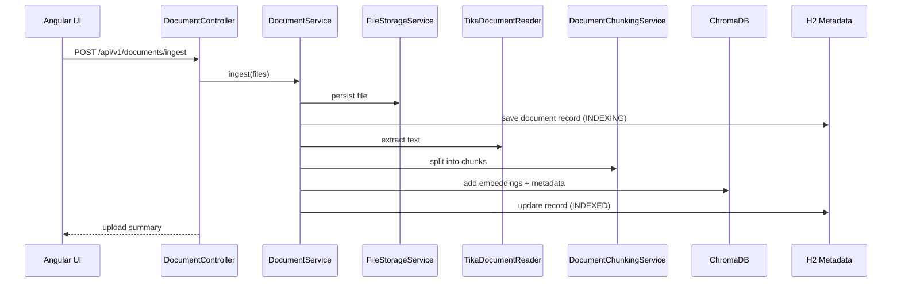
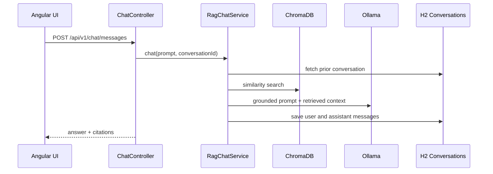

# Architecture Overview

## Goal

Provide a local-first, open-source-friendly RAG application where users can ingest business documents and interact with them through a conversational UI.

## System components

### Frontend

- Angular standalone application
- Chat workspace for prompt entry and response rendering
- Upload flow for ingestion
- Document list for indexed sources

### Backend

- Spring Boot REST API
- Spring AI orchestration for retrieval + generation
- Apache Tika extraction pipeline
- H2 persistence for metadata and conversation history

### External runtime services

- Ollama for chat and embedding models
- ChromaDB for vector persistence and similarity search

## Request flows

### Document ingestion flow

### Chat flow

## Architectural choices

## Layered backend

- `controller`: HTTP entry points
- `service`: orchestration and business logic
- `repository`: Spring Data JPA persistence access
- `entity`: H2 persistence models
- `dto`: API contracts
- `config`: infrastructure and external client configuration
- `exception`: cross-cutting error handling

## Why Tika + TokenTextSplitter

- Tika supports a wide set of office and document file formats.
- Spring AI `TokenTextSplitter` gives token-aware chunking rather than naive fixed-character slicing.
- Chunk metadata is preserved for traceability and deletion.

## Why H2 plus ChromaDB

- H2 stores operational metadata: upload status, filenames, checksums, and conversation history.
- ChromaDB stores chunk embeddings and supports similarity search.
- Separating operational persistence from vector persistence keeps responsibilities clear.

## Deployment shape

For local development:

- Angular dev server on `4200`
- Spring Boot backend on `8080`
- ChromaDB on `8000`
- Ollama on `11434`
